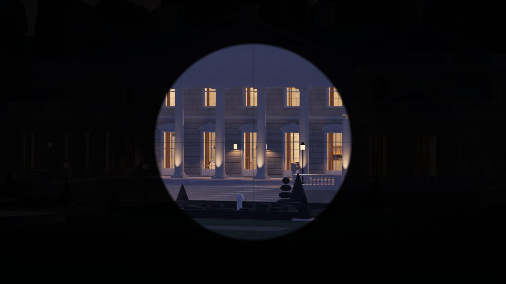
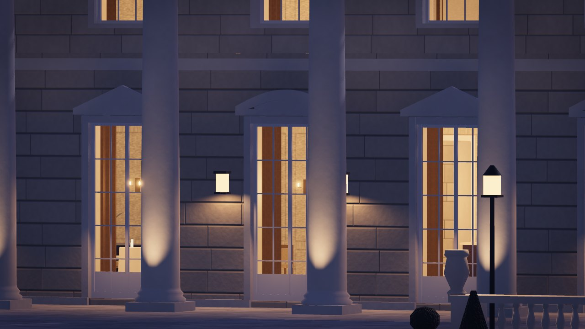
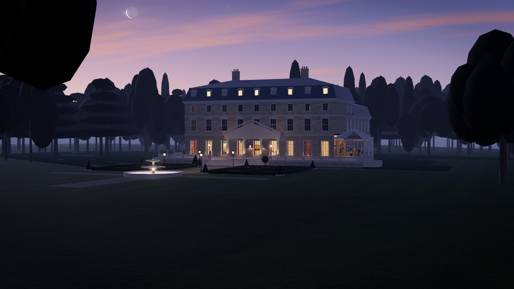
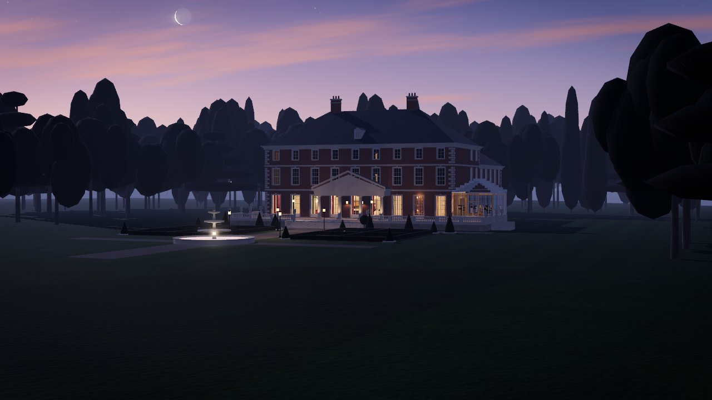
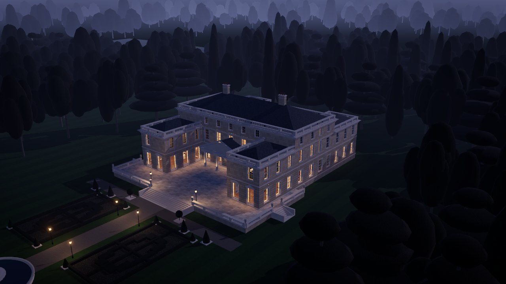
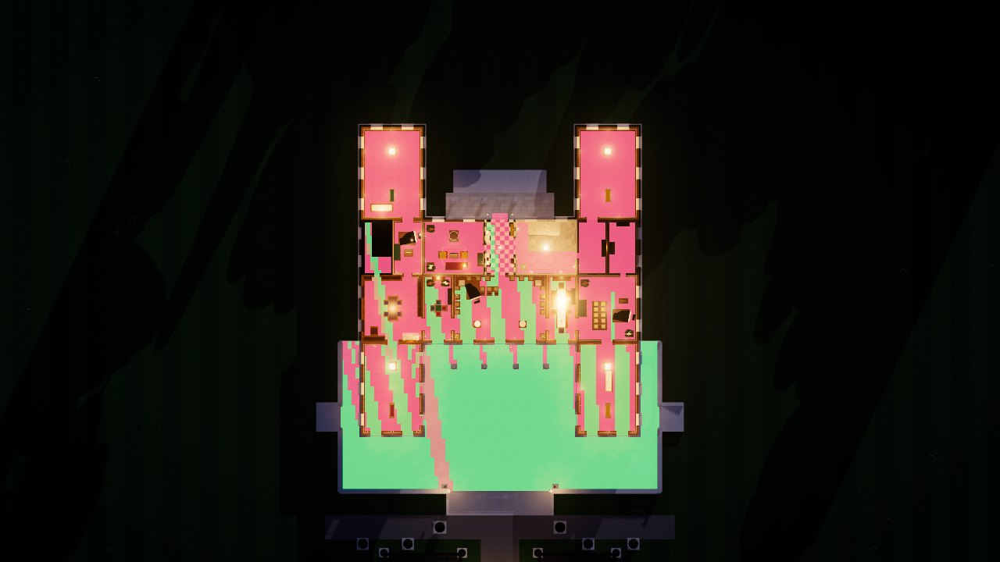

# scope-and-drop

Sniper spy deduction game. Users scope the terrain and drop the deduced target.

This repository currently holds the **mansion generation module**: a seeded generator that builds a different country house for every match, plus a three.js renderer that shows it the way the sniper does, at blue hour from a treeline 130–210 m away.

| Sniper scope | Inside, at full zoom |
|---|---|
|  |  |
| **Beaux-Arts, wide** | **Georgian, wide** |
|  |  |
| **Estate** | **Sightlines from the perch** (green = watchable) |
|  |  |

## Quick start

```bash
npm install
npm run dev          # demo viewer at http://127.0.0.1:5173 (scope / wide / orbit / iso / plan)
npm test             # determinism, validity across seeds, nav, sightlines, geometry
npx tsx scripts/gen.ts --seed match-42 --plan          # print a blueprint summary
npx tsx scripts/render.ts --seed match-42 --views scope,wide   # headless renders
```

## Use it

```ts
import { generateMansion } from './src/mansion';
import { buildMansion } from './src/mansion/build';

const bp = generateMansion({ seed: 'match-42' });   // pure data, deterministic, works on a server
bp.validation.ok;                                    // structurally sound and a fair level
bp.pois;                                             // mission objects with NPC stand points
bp.nav.levels[0].vis;                                // per-cell visibility from the sniper

const mansion = buildMansion(bp, { renderer });     // three.js scene, twilight-lit
scene.add(mansion.root);
camera.position.copy(mansion.perch.position);
```

The design, validity rules, data contract and art direction are in [docs/mansion-generation.md](docs/mansion-generation.md).
