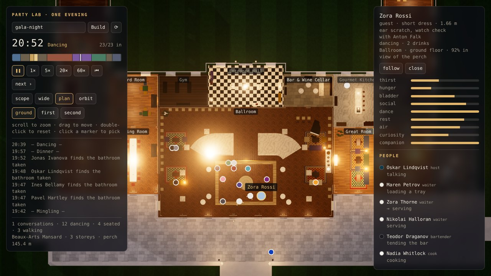
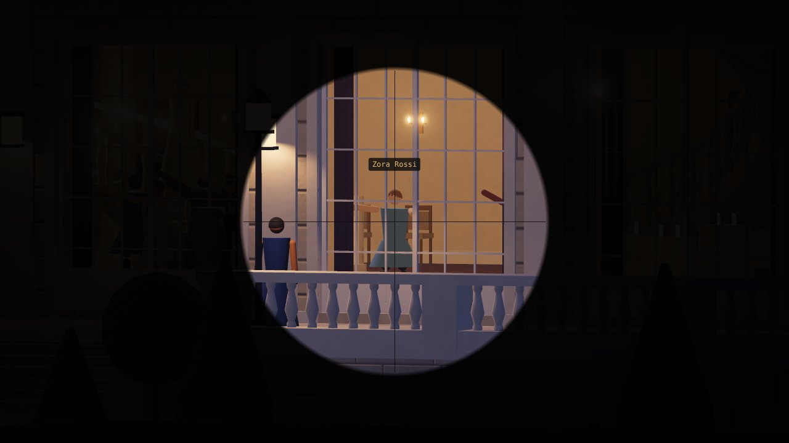

# The party

`src/party/` plays one evening at a generated mansion: 20–30 guests, the staff and a host, through a fixed programme from 19:00 to 22:00. It is milestone 1 (party core) of the design spec, [Guests and the Spy](https://claude.ai/code/artifact/e2c50e9e-e5fd-40d7-ba1f-e5b112831f52). The spy, gossip, mishaps, the search for a missing person and the endings come in the later milestones.



```ts
import { generateMansion } from './src/mansion';
import { Party } from './src/party';

const party = new Party(generateMansion({ seed: 'gala-night' }));
party.advance(95 * 60);          // to 20:35
party.people[7].action?.id;      // 'dinner'
party.visibility(party.people[7]); // 0..1, from the house's perch visibility grid
```

The same blueprint and seed always give the same evening. Everything is plain data, so a run can be stepped headless, hashed (`party.digest()`) and replayed.

## Time

The party is 3 in-game hours played in 1 real hour (`TIME_SCALE = 3`). Only the clock is compressed: people walk at real speed, so a sim step of `dt` in-game seconds moves them `dt / 3` seconds' worth of distance. The sim steps every 0.5 in-game seconds, six times a real second at 1×.

| Phase | Nominal start | Length (min) |
|---|---|---|
| Arrival | 19:00 | 15 |
| Mingling | 19:15 | 15 |
| Champagne | 19:30 | 6 |
| Toast | 19:36 | 6 |
| Mingling | 19:42 | 18 |
| Dinner | 20:00 | 40 |
| Dancing | 20:40 | 30 |
| Evening games | 21:10 | 25 |
| Mingling | 21:35 | 10 |
| Last toasts and departures | 21:45 | 15 |

Each boundary moves by up to 3 minutes per seed (less around the short champagne and toast). Each person also notices a new phase 20–150 s late, so the room never moves as one.

## How a guest decides

Guests run a needs-based utility AI, in the style of The Sims. Nine needs run down over the evening at rates set by each guest's traits: thirst, hunger, bladder, social, dance, rest, air, curiosity, and being near one's partner. When a guest is free, they list what they could do now (join or start a conversation, get a drink, the bathroom, sit, look at the art, go out on the terrace, dance, play a game, wander, toast, dine, leave) and score each one:

```
score = phase weight × need term × personal modifier × distance penalty × jitter
```

The best option of each kind competes, then the choice is a weighted draw among the top five (weight = score²). The phase weights carry the programme: during the toast the only other option is a trip to the bathroom, at a small weight, and dinner works the same way. An action ends after its duration and refills the needs it serves.

The house is read once into places (`places.ts`): the entrance, the party rooms, the toast spot in the ballroom or dome hall, dining chairs (head of the table first), buffet spots, a grid on the dance floor, the bars, bathrooms with a door spot and an inside spot, sofas and armchairs, the art, the game tables (billiards, cards, piano, cinema), the terrace and the kitchen.

Rules on top of the scores:

- Bathrooms are occupied one at a time. A guest who finds one taken queues at the door if it is urgent, otherwise remembers it and comes back later.
- Spots, seats and conversation slots are reserved, so nobody stands inside anyone else.
- Couples dance together and sit together at dinner; the host and their partner head the table.
- Champagne comes from the nearest waiter with a tray, or from the bar.
- Departures are forced in the last quarter of the farewell, so everyone has left by 22:00.

## Staff and the host

The host greets at the door through the arrival, announces each phase, leads the toasts, heads the table and sees the guests off. Waiters (2–3) load a tray at the bar or kitchen and make four stops in the party rooms (the dining room at dinner). The bartender stays at the bar and the cook in the kitchen.

## Walking

A* runs on the mansion's walk grid (0.25 m cells, 8 neighbours, no cutting corners), and the path is string-pulled to a few waypoints with an exact grid traversal, so a straight leg never crosses a blocked cell. Stairs join the storeys; a route crosses one storey at a time through the stair with the shortest detour. People push apart to 0.42 m, and anyone pushed off their line finds a new route from where they stand.

## People on screen

`render/crowd.ts` draws everyone as simple jointed figures, one `InstancedMesh` per body part (thighs, shins, skirt, torso, shirt front, head, hair, arms, a glass, a tray, a hat, glasses, a cane). The mansion's scoped room lights reach them through a per-person `aScope`. Poses come from the sim (walk, climb, sit, talk with the group's speaker gesturing, drink, toast, dance, play, serve, smoke, greet, announce, look), and habits show while standing about (scratching an ear, checking a watch, hands in pockets, a big laugh). A plan marker in the outfit's colour shows each person on the storey the plan cuts. Detailed bodies and the full body-language catalogue are milestone 5.



## Party lab

`npm run dev`, then open http://127.0.0.1:5173/party/ (on Pages: `/demo/party/`).

- The clock, the phase, and a timeline of the programme. Click the timeline to jump; going back replays the evening from 19:00.
- Speeds: pause, 1× (the evening in an hour), 5×, 20× and 60×; back to 19:00; next phase. Space pauses.
- Views: scope (from the perch; scroll to zoom, drag to aim), wide, plan (scroll to zoom, drag to pan, one storey at a time) and orbit.
- The people list shows what everyone is doing. Click a name, or a person in any view, to see their role, habits, partner, drinks, room, how visible they are from the perch, and their needs. The scope follows them; the plan turns to their floor.

| URL parameter | Meaning |
|---|---|
| `seed` | House seed (the party uses the same seed unless `party` is given) |
| `party`, `guests` | Party seed; number of guests |
| `t` | Start time: minutes after 19:00, or a clock time such as `20:30` |
| `speed` | 0, 1, 5, 20 or 60 |
| `view`, `fov`, `level`, `zoom`, `px`, `pz` | View, scope field of view, plan storey, plan zoom and pan (metres) |
| `sel`, `follow` | Select a person by index; keep the scope on them |
| `shot=1&w=&h=&ui=1` | Headless capture (`ui=1` keeps the panels) |

Stills: `npx tsx scripts/render.ts --page party/ --views plan,scope --params "t=115&sel=20&follow=1"`.

## Numbers

Measured on three houses, `gala-night`, `match-42` and `orangery-1` (21–28 guests):

| Measure | Result | Test asks |
|---|---|---|
| A whole evening, headless (21,600 steps) | 1.2–1.7 s | under 20 s |
| Guests at the toast, 85% of the way through it | 100% | ≥ 70% |
| Guests at dinner, 60% of the way through it | 100%, and every guest with a chair seated | ≥ 90% |
| Guests dancing, halfway through the dancing | 39–71% | ≥ 30% |
| Samples off the walkable floor (a person every 30 s) | 0 of 6,000–8,000 | 0 |
| Guests gone by 22:00 | all | all |

## Tuning notes

- Guests head for the nearest bathroom and only learn it is taken at the door: 29–64 "bathroom taken" moments an evening, more in houses with fewer bathrooms, most of them just before dinner. Bathrooms are part of milestone 2, where guests will see a closed door or a queue from across the room.
- Conversation groups stay small and few (0–3 at a time). Mingling will grow when gossip gives guests something to talk about (milestone 2).

## Files

| File | What it holds |
|---|---|
| `clock.ts` | Time scale, the programme and its jitter, clock labels |
| `types.ts` | People, looks, traits, needs, actions, groups, events |
| `places.ts` | Everything the minds need from the blueprint, as walkable spots and seats |
| `path.ts` | A* per storey, string pulling, stairs between storeys |
| `cast.ts` | Names, roles, outfits, habits, couples and friends, arrival times, dinner seats |
| `mind.ts` | Need decay, the options and their scores, the weighted choice |
| `sim.ts` | `Party`: the step loop, phases, walking, bathrooms, staff, the host, groups |
| `render/crowd.ts` | The instanced three.js crowd |
| `tests/party.test.ts` | Programme, cast, determinism and a whole evening |
