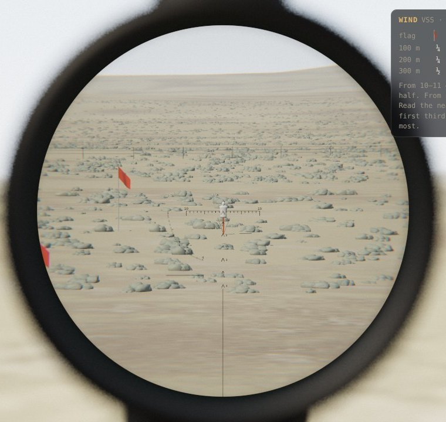
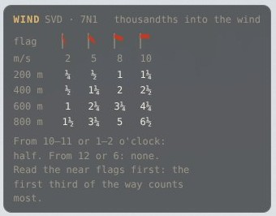
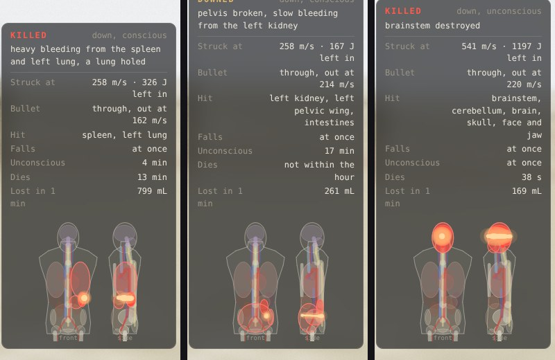
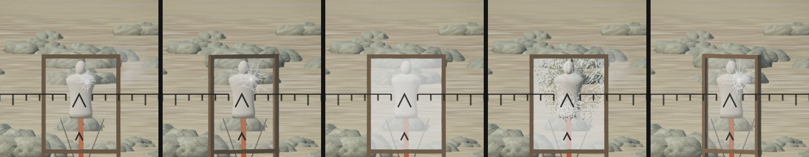

# Reticle lab: research and plan

`/demo/reticle/` is a stand-alone page that renders what an eye sees through a first-focal-plane (FFP) riflescope, with three rifles and their reticles: an SVD with a PSO-1 pattern and its rangefinder, a bolt rifle with a mil tree, and the game's rifle, a suppressed VSS with a PSO-1-1 pattern (section 3 says why). The look follows the two reference frames (a camera behind a tactical scope in high desert): a dark, defocused ocular ring, a blown-out world outside it, a slightly vignetted image inside, and a crisp etched reticle.

| PSO at 9× | Eyebox shadow (20×, eye 1.6 mm right, 14 mm too far back) |
| --- | --- |
|  |  |

## How to aim

The short version, for players new to scopes. The numbers behind it are in section 3.

1. **Leave the drum on 1.** The rifle is then zeroed at 100 m, and that is the only setting the chevrons are made for.
2. **Find the range.** Use the curve at lower left: put the man's feet on the straight line, then move until his head touches the dashed curve. The number there is the range in hundreds of metres. The mannequins are 1.7 m tall, like the man the curve is drawn for.
3. **Pick your hold.** Each chevron below the centre is for one range. Put the matching chevron on the chest, not the top one.
   - **At a marked range**, use its chevron. The top chevron is for 100 m.
   - **Between two marks**, hold between their chevrons in proportion. For 500 m on the SVD, hold halfway between the 4 and the 6. Holding the nearest chevron instead can miss by over half a metre.
   - **VSS (the game's rifle):** there's a chevron every 50 m. The small ones are 150, 250 and 350. At the game's 183 m, hold a third of the way from the 2 up to the small 150 chevron.
   - **Or dial it instead:** turn the drum to the range and aim with the top chevron. That's exact, but the other chevrons are then wrong until you turn it back to 1.
4. **Range carefully.** With the slow VSS bullet, 16 m of range error is about 18 cm at 183 m, enough to miss the chest. If unsure, range again.
5. **Wind.** A crosswind pushes the bullet downwind, so aim into it, using the marks on the horizontal line (one per thousandth). Nothing tells you the wind's speed: you read it.
   - **Read the flags.** A red flag hanging down means calm. Standing out about halfway (45° from the pole) means a moderate wind, 5 m/s. Straight out means 10 m/s or more. In between, the sage shakes and paler patches run across the ground in the gusts. Through the scope the mirage runs with the wind.
   - **Look the hold up on the wind card** (top right). Pick the column whose flag looks like the one you see and the row for your range. The card assumes wind straight across. From 10–11 or 1–2 o'clock, hold half. From 12 or 6, hold nothing.
   - **Trust the near flags most.** About half the drift comes from the first third of the way, so a gust at your feet matters more than one at the target.
   - **Gusts travel.** A gust is carried downwind at the wind's speed, so you can see it coming across the sage and the near flags before it reaches the line. Fire in a lull, or hold for the gust that will be there.
   - **Easy** puts a wind meter on a mast at your hide, as high as the flags, and adds its m/s under the card's flags. It reads the wind at the hide, not along the way.
   - For scale, at 2.5 m/s straight across: about 0.3 thousandth on the VSS at 183 m (6 cm), 0.7 on the SVD at 412 m (30 cm), 1.6 on the SVD at 800 m (1.4 m).
6. **Watch the hit and correct.** Stay on the scope after the shot. The VSS's light kick keeps the target in view, and its bullet takes 0.7 s to get there. If it lands low, hold that much higher next time. If it lands left, hold right.

**Mil tree (bolt rifle):** the tree isn't made for any round, so work the hold out from the ammo card. Turn the dial to 0 and the hold in mil is 1000 × drop ÷ range, with the drop worked out from the bullet's speed (section 3).

## 1. The scope being simulated

A good, well set-up 4–20×50 FFP scope (`src/scope/optics.ts`, `SCOPE`):

| Quantity | Value | Why |
| --- | --- | --- |
| Magnification | 4–20× | Covers PSO-1 power (4×) and long-range tree use. |
| Objective | 50 mm | Typical tactical glass. Exit pupil = 50 / mag: 12.5 mm at 4×, 2.5 mm at 20×. |
| Apparent field | 24° | Constant across the zoom range. True field = 2·atan(tan 12° / mag), which gives 6.06° at 4×, the PSO-1's own 6° field. |
| Eye relief | 90 mm | The eye's default position. |
| Distortion | 2.5 % pincushion at the rim | Good scopes keep some pincushion to stop the "rolling ball" (globe) effect when panning. |
| Lateral colour | ±0.6 % at the rim | A faint red/blue split at the field edge. |
| Rim softness | ≈1.5 px at the field stop, rising as r⁶ | Field curvature and coma in a good eyepiece: sharp over most of the field, soft only at the very edge. |
| Pupil aberration | 2.5 mm at the field stop, rising as r² | Bundles from the edge of the field cross the axis a little nearer the eyepiece. An eye that slips sideways sees a crescent come in from that side rather than an even dimming. |

The defaults describe a scope that is good and properly adjusted: the parallax knob is set to the target range and the eye sits on the exit pupil at full eye relief. Each rifle is zeroed at 100 m: its elevation drum sits on 1, where the cut reticles are true, and every hold past that comes from the reticle (the drum on top of the scope, and "Zero" in the panel). The drum turns in 50 m clicks from 1 up to its last mark (section 3). You change power. Everything else is there to experiment with.

## 2. Reticles (`src/scope/reticles.ts`)

All three reticles are lists of resolution-free primitives (lines, polylines, dots, numerals) in their own angular unit. Stroke widths are angular too. Because the reticle sits in the first focal plane, `pxPerUnit = (canvas/2) · mag · tan(unit) / tan(half apparent field)`: the whole pattern, strokes included, grows with power and stays true against the target at every power. At 4× the tree's fine lines go sub-pixel and faint, which is how FFP glass behaves.

### SVD · PSO-1 (unit: Soviet "thousandth", 2π/6000 ≈ 1.047 mrad)

- **Main chevron** at the aiming point, 1.0 × 1.0 thousandth.
- **Three holdover chevrons** below it, cut for the 7N1 round at 400, 600 and 800 m with the 100 m zero (drum on 1) and marked 4, 6 and 8 (see section 3).
- **A vertical stadia** from below the last chevron down to the field stop.
- **Lateral scale** every thousandth to ±10, with longer marks at 5 and 10 and "10" labels. It is used for windage, lead and ranging.
- **Stadiametric rangefinder** at lower left: a solid base line and a dashed curve whose height above the line is `1.7 m / range`, marked 2 to 10 (×100 m). Put the feet on the line and slide until the head touches the curve, then read the range. The test `tests/scope.test.ts` checks that the curve brackets a 1.7 m man at exactly its marked ranges. The mannequin on the range is 1.7 m tall overall, so ranging works on it at 412 m.
- **Illumination** (`L` or the Illum button) lights the whole pattern red, as on the PSO-1.

### VSS · PSO-1-1 (unit: thousandth), the game's rifle

- **Main chevron** at the aiming point, as on the PSO.
- **Six holdover chevrons** cut for the subsonic SP-5 with the 100 m zero (drum on 1): numbered ones at 200, 300 and 400 m (6.2, 12.9 and 20.0 thousandths down) and smaller plain ones at 150, 250 and 350 m. 100 m is the zero, so the aiming chevron is its mark. The real 9×39 scopes (PSO-1-1, PSO-1M2-1) have a single chevron, a range drum cut for the round and a rangefinder out to 400 m. With the drum left on 1 the drum's job past 100 m moves onto the glass, as it does on the SVD's PSO. The 50 m steps are there because at the game's range the hold changes by a thousandth every 16 m.
- **Lateral scale** as on the PSO, and the vertical stadia below the last chevron.
- **Stadiametric rangefinder** re-cut for 100–400 m, as on the 9×39 scopes: base line, dashed 1.7 m curve, a tick every 50 m and numbers 1 to 4 (×100 m). A test checks that the drawn ticks bracket a 1.7 m man at their ranges.
- **Illumination** lights the whole pattern.

VSS at 8×, drum on 1, held for the mannequin at 183 m: the point 5.1 thousandths down, a third of the way from the 200 m chevron up to the 150 m one, is on the chest.

### Mil tree (unit: mrad), after the reference footage

- Heavy 0.32 mil posts from 8 mil (12 mil below) out to the field stop.
- A fine 0.05 mil crosshair with a floating 0.14 mil centre dot. It is hashed every 0.5 mil, with longer marks on whole mils and small numerals at 2, 4 and 6.
- **Tree** rows at 2, 4, 6, 8 and 10 mil of drop. They have crosses on whole mils and dots on halves, and their width grows with drop (±2 to ±6 mil) because wind holds grow with range. Each row is numbered.
- **Illumination** lights the centre dot and the fine crosshair.

## 3. Rounds and holds (`src/scope/ballistics.ts`)

Each reticle is paired with the round its rifle fires. Bullet flight comes from a point-mass solver: standard G7 drag, ICAO sea-level air (1.225 kg/m³, speed of sound 340 m/s), RK4 at 0.5 ms, and no wind or spin drift. I checked it against Federal's published table for the 175 gr SMK at 2600 ft/s (G7 0.25). Velocities land within 1.5 % out to 500 yd. With a 100 yd zero, the drops at 200 and 300 yd are −4.4 in and −15.7 in, exactly as printed.

| Reticle | Round | Bullet | Muzzle speed | G7 BC |
| --- | --- | --- | --- | --- |
| SVD · PSO | 7N1, 7.62×54R | 151 gr (9.8 g) | 823 m/s | 0.206 |
| Mil tree | M118LR, 7.62×51 | 175 gr SMK | 790 m/s | 0.243 (Litz) |
| VSS · PSO-1-1 | SP-5, 9×39 | 250 gr (16.2 g), 36 mm spire-point boat-tail | 280 m/s | 0.21 (estimated) |

The SP-5's speed is the chronograph's: 905 ft/s (276 m/s) from a VSS, against 270–290 m/s in published tables. No BC is published for it. At Mach 0.8 a boat-tail bullet drags about 1.28 times as much as the G7 shape, which gives G7 ≈ 0.21 (G1 ≈ 0.40 at this speed). The guess hardly matters at the game's range, because the drop there comes from the flight time: G1 0.28 instead would move the 183 m hold by 0.3 thousandth.

### Zero and the elevation drum

Every rifle is zeroed at 100 m, as the SVD's manual has it: zeroing is done at 100 m with the drum on 1. The drum's numbers are ranges in hundreds of metres, and on a mark the rifle is zeroed at that range: the bore is tilted up under the scope just enough for the bullet to climb back to the line of sight there. The scope sits above the bore (`sightM`), so the bullet starts below the line of sight and that offset counts too:

`tilt(Z) = (drop(Z) + h) / Z`, and the hold below the line of sight at range R is `(drop(R) + h) / R − tilt(Z)`.

The manual pins the sight height. Its zeroing check is fired at 100 m with the drum on 3 and expects the hits 14 cm above the aim. With the 7N1 model that comes out at 14 cm only for a scope 70 mm over the bore (tested), so the SVD's is 70 mm. The VSS's PSO-1-1 sits on the same side rail (70 mm, assumed) and the bolt rifle's scope is 58 mm up, as modelled.

| Rifle | Drum | Clicks | 100 m zero tilt |
| --- | --- | --- | --- |
| SVD · PSO-1 | 1 to 10 (100–1000 m) | 50 m | 1.45 thousandths |
| Bolt rifle | Ballistic dial cut for the M118LR (as Leupold's CDS dials are), 0, then 1 to 10 | 50 m | 1.41 mil |
| VSS · PSO-1-1 | 1 to 4 (100–400 m) | 50 m | 6.8 thousandths |

As on the real PSO-1, the drum starts at 1 ([Wikipedia](https://en.wikipedia.org/wiki/PSO-1): 100–1000 m in 50 or 100 m steps). On the SVD and VSS a 0 (bore parallel to the line of sight) would only throw the cut chevrons off, so they have none. The bolt rifle's dial keeps one: its tree is not cut for a round, and on 0 the mil-tree hold is simply drop ÷ range (step 4 below drops out). The drum is part of the 3D scope: a knurled drum with its numbers engraved round its side (15° a detent, so the SVD's 10 and 1 sit far apart), read against a white index line on the saddle behind it. The rifle stays blurred, as the eye is on the range. With the head up (F) the shooter looks down at the drum when the pointer is on it or `[` or `]` clicks it: the eye focuses on it, 0.29 m away, over a few tenths of a second, so the numbers come sharp and the range behind goes soft. It stays there while the pointer does and for 1.5 s after the last click or after the pointer leaves, then the eye goes back to the range. Drag the drum sideways, scroll over it or tap either side of it; each detent clicks. On the weld it can't be seen, but `[` and `]` still click it by feel, as shooters count clicks. Each rifle keeps its own drum setting. A cut reticle is glass, so its chevrons are true only with the drum on 1: on 3 the SVD's chevrons shoot high, and the shooter on a higher drum setting aims with the top chevron at that range instead. That is how the real PSO-1's own chevrons work, true only with the drum on 10.

Sources: [snakeproject: bringing the SVD to normal battle](https://snakeproject.ru/rubric/article.php?art=nsd05012024) (100 m, drum on 3, control point 14 cm above the aim), [PSO instruction manual](https://sheldy.ru/userfiles/files/PCO(1).pdf) (zeroing at 100 m with the drum on 1, 5 cm per click at 100 m), [Wikipedia: PSO-1](https://en.wikipedia.org/wiki/PSO-1).

**SVD: the reticle does the work.** The PSO's three holdover chevrons are cut for the 7N1 at 400, 600 and 800 m with the drum on 1, sitting 2.39, 5.10 and 8.96 thousandths under the aiming chevron, and they are marked 4, 6 and 8. Range the target with the curve, then put the matching chevron on it. On a real PSO-1 the same three chevrons serve 1100–1300 m with the drum on 10. With the drum left on 1, they are re-cut for the ranges an SVD actually shoots.

**VSS: the reticle does the work, and the range is everything.** The SP-5 leaves at 280 m/s and is still doing 260 m/s at 183 m, so it drops 2.2 m on the way and takes 0.68 s. Range the target with the curve and hold the matching point between the chevrons: 5.1 thousandths at 183 m with the drum on 1, a third of the way from the 200 m chevron up to the 150 m one. A 10 m range error puts the bullet 13 cm high or low, so the 50 m chevrons and the rangefinder carry the shot. Wind matters less than the flight time suggests: the heavy bullet barely slows, so a full 3 m/s crosswind moves it only 7.5 cm (0.4 thousandth) at 183 m.

**Mil tree: the shooter does the work.** The tree is generic, so when it is selected an ammo card in the top right shows the round and its speed every 200 m, as printed on a box of match ammunition. The intended hand method:

1. Range the target with the mil relation: `range = size (m) × 1000 / mils`.
2. Flight time ≈ range ÷ the mean of the muzzle speed and the speed at that range.
3. Drop ≈ ½·g·t². Hold from the bore line (mil) = 1000 × (drop + sight height) ÷ range.
4. Take off the same for the zero, 100 m: about 1.4 mil with the dial on 1. The card's header gives the zero and the sight height. With the dial on 0 there is no zero to take off, and the sight height alone stays (0.14 mil at 412 m).

Drag also slows the fall a little, so step 3 reads 5–10 % high. With the zero taken off, that error is a bigger share of what is left: the method reads 12–20 % high, from 0.1 mil at 200 m to 1.1 mil at 800 m. That is close enough for a torso at 400 m. Past 600 m the shooter has to learn the rifle. `handHoldRad` encodes step 3, and a test pins the gap. Skipping the sight height in steps 3 and 4 adds another 0.4 mil high at 400 m.

| Range | Speed | True hold, drum on 1 | Hand estimate |
| --- | --- | --- | --- |
| 200 m | 671 m/s | 0.63 mil | 0.76 mil |
| 400 m | 563 m/s | 2.69 mil | 3.06 mil |
| 600 m | 464 m/s | 5.47 mil | 6.21 mil |
| 800 m | 374 m/s | 9.18 mil | 10.29 mil |

### Which rifle the game needs

The mansion module defines no weapon. What it fixes is the shot: prone in a treeline at blue hour, 130–210 m from the house, into a lit party through glass (French windows that are about 70 % glass, sheer curtains, a glass dome over the hall), at one guest among many. The lab's first two rifles were picked for a 412 m desert range instead:

| At the game's range (183 m), 100 m zero | SVD + 7N1 | Bolt rifle + M118LR | VSS + SP-5 |
| --- | --- | --- | --- |
| Hold | 0.4 thousandth, just under the main chevron | 0.5 mil | 5.1 thousandths, between the 150 and 200 m chevrons |
| Flight time | 0.24 s | 0.25 s | 0.68 s |
| Sound along the path | A supersonic crack heard by everyone near the line of fire | The same | None: the bullet is slower than sound |
| Report at 1 m | Over 160 dB | Over 160 dB | About 121 dB, measured on a VSS with SP-5 |
| Free recoil | 18 J | 12 J | 3.2 J |
| Effective range | 800 m | 800 m and more | 400 m by day, 300 m at night |

The VSS "Vintorez" is what the job is built for: an integrally suppressed, subsonic sniper rifle designed for covert shots at 200–300 m, with the PSO-1-1 scope cut for its 9×39 round. It keeps the lab's Soviet PSO lineage (same unit, same chevrons and rangefinder), and it makes the shot a skill rather than a formality: at 183 m the bullet drops 2.2 m, so ranging the target and choosing the hold decide the hit, where the 7N1's 0.4 thousandth would barely need a hold at all. Its light recoil keeps the target in the glass, so the shooter sees what the shot did, which a deduction game needs.

So the VSS with SP-5 is the game's rifle. The SVD and the bolt rifle stay as they were, on the 412 m mannequin, as the loud long-range comparisons. A second mannequin stands at 183 m for the VSS. Glass is section 11.

Sources: [SADJ: the elusive Vintorez](https://sadefensejournal.com/the-elusive-vintorez-9x39-sniper-rifle/2/) (chronograph; sound levels: SP-5 120.8 dB, an unsuppressed 9×39 159.8 dB), [Wikipedia: AS Val and VSS](https://en.wikipedia.org/wiki/AS_Val_and_VSS_Vintorez), [Wikipedia: PSO-1](https://en.wikipedia.org/wiki/PSO-1) (the PSO-1M2-1's single chevron and 400 m rangefinder), [Modern Firearms: VSS](https://modernfirearms.net/en/sniper-rifles/standart-caliber-rifles/russia-standart-caliber-rifles/vss-eng/) (3.41 kg loaded with the scope), [militaryroom: VSS](http://militaryroom.rusff.me/viewtopic.php?id=1848) (SP-5 bullet 36 mm, 16.2 g; 4 shots inside 75 mm at 100 m), [armoury-online: VSS](https://www.armoury-online.ru/articles/sr/ru/vss/) (400 m by day, 300 m at night).

## 4. Optical effects (`demo/reticle/composite.ts`)

Each screen pixel is converted to an apparent direction `t = tan(angle)` (the field stop is at `t = tan 12°`). Then:

1. **Naked-eye world.** A second camera renders the scene at 1× with the same angular mapping. It is defocused and over-exposed like the reference camera.
2. **Ocular housing.** The eyepiece bell is part of the 3D rifle (section 6), a few centimetres from an eye focused far away, so it is heavily blurred. It slides against head movement while the field stop (imaged at infinity) stays put.
3. **Eyebox: scope shadow, crescents, tunnelling.** Every field direction leaves the eyepiece as a bundle as wide as the exit pupil, and the bundles cross at the exit pupil. Light that appears to come from direction `t` travels the opposite way, so with the eye `Δz` behind the exit pupil the bundle for `t` is centred at `−Δz·t`. Edge bundles cross a little early (the pupil aberration above). The light reaching the eye is the overlap of that disc with the eye pupil (3 mm in daylight), computed exactly as a circle–circle intersection (`eyeboxTransmission`, mirrored in GLSL). This gives:
   - too far back, the exit pupil works like a window in front of the eye, so a crescent comes in from the side the head has moved to;
   - too close, the crescent comes in from the other side;
   - at the right eye relief, a sideways slip darkens the eye's own side first, then dims the whole field;
   - at high power the exit pupil shrinks, so the eyebox gets tight. Even with the eye centred, the rim is about 20 % darker at 16×, as on real glass.
4. **Pan shadow.** Prone, the rifle swings about its front support (bipod or bag), about 600 mm ahead of the eye, so the eyepiece moves the opposite way to the muzzle. The head rides along on the cheek weld but trails it by a 30 ms lag. In a quick swing that leaves the eye off the exit pupil toward the way the muzzle is going, so a crescent creeps in from the leading edge and clears once the swing stops. Panning right at 4°/s at 12× puts the eye 1.3 mm off: the right edge drops to about half and the centre to three quarters. The **Pan shadow** slider scales the lag from 0 (head glued to the stock) through 1 (the default) to 2 (a loose cheek weld, which blacks out a quick swing).

   | Panning right at 4°/s, 12×, Pan shadow 1 | Pan shadow 2 |
   | --- | --- |
   |  |  |

5. **Parallax.** An eye offset `e` in the exit pupil corresponds to a ray `e·mag` off-axis at the objective. When the target is not focused on the reticle plane, the reticle shifts by `aperture · (1/D − 1/P)` radians (`parallaxShiftRad`), where `D` is the range to whatever the crosshair rests on (ray-marched each frame) and `P` is the parallax knob. Set `P = D` and the reticle stays glued to the target however the head moves.
6. **Focus.** The parallax knob is also the focus. The blur circle is `objective · |1/D − 1/P|` and is applied to the image but not the reticle.
7. **Distortion, lateral colour and rim softness** as in the table above. They are applied to the image and the FFP reticle alike, because both pass through the erector and eyepiece.
8. **Mirage.** Two octaves of flowing noise displace the image (not the reticle) by about 25 µrad. It is invisible at 4× and boils at 20×, and it is faded out for short ranges.
9. **Veiling glare.** A small lift of the blacks, as with real glass.
10. **Hold.** Breathing sway (about 0.3 mrad figure-eight), a heartbeat twitch, and a slow sub-millimetre head wander on a solid cheek weld. Everything moves together, because the reticle is fixed to the tube.

## 5. Recoil (`src/scope/recoil.ts`)

This is the gun's motion when it fires (Space, or **Fire** in the panel). The bullet itself is section 6.

| Before | 16 ms | 80 ms |
| --- | --- | --- |
|  |  |  |
| **200 ms** | **350 ms** | **3 s** |
|  |  |  |

SVD at 8×. The scope slams toward the eye and the picture tunnels. The eye drops below the exit pupil, so the picture goes dark apart from a crescent of light at the bottom, which widens as the head settles. By 0.35 s the picture is back, full of sky, and the rifle settles 1.2° high with the target at the bottom edge. At 8× the artifacts last about 0.3 s. At higher power the eyebox is tighter and they last longer.

**How hard each rifle kicks.** Free recoil, with SAAMI's rule that the powder gas leaves at 1.75 × the bullet's speed:

| Rifle | Round | Impulse | Mass | Free recoil |
| --- | --- | --- | --- | --- |
| SVD (PSO reticle) | 7N1: 9.8 g at 823 m/s, 3.1 g of powder | 12.5 N·s | 4.3 kg | 2.9 m/s, 18 J |
| Bolt rifle (mil tree) | M118LR: 11.3 g at 790 m/s, 2.9 g of powder | 12.9 N·s | 6.8 kg | 1.9 m/s, 12 J |
| VSS (PSO-1-1) | SP-5: 16.2 g at 280 m/s, its 0.6 g of powder gas mostly held back by the integral suppressor | 4.7 N·s | 3.41 kg | 1.4 m/s, 3.2 J |

The lighter SVD kicks harder, so its motions are about 1.5 × the bolt rifle's. The VSS kicks a fifth as hard as the SVD, like a light carbine. Its motions are scaled from the other two by recoil speed: the scope comes about 10 mm back, the muzzle hops 1° and settles 0.4° high, and the stock barely slaps the cheek. At 8× the picture dims and shrinks for about 0.15 s instead of blacking out, and a target held on its 183 m mark stays in the field, so the shooter watches the hit.

**Three motions overlap**, and each one drives an artifact from section 4:

1. **The scope comes back at the eye.** The rifle slams into the shoulder, so 16 ms after the shot the eyepiece is 24 mm closer than its eye relief (17 mm for the bolt rifle). The shoulder pushes it forward again only slowly, with a 0.45 s time constant (0.38 s for the bolt rifle): it is still 16 mm too close at 0.2 s and 10 mm at 0.4 s. Too close, the bundles from the edge of the field miss the eye pupil, and the picture shrinks to a tunnel inside a thick black ring.
2. **The muzzle rises.** It peaks at 3.1° about 90 ms after the shot (2.0° at 105 ms for the bolt rifle), a little to the right, with a short 26 Hz ring-down of the tube on top. Then it falls back to a rise that stays: 1.2° up and 0.2° right for the SVD, 0.8° up for the bolt rifle.
3. **The head is jolted off the cheek weld.** It settles back with a 0.28 s lag, so the scope tilts up to 2.6° against the eye at about 80 ms. The whole sight picture, reticle and field stop included, moves with that tilt, and the ocular housing jumps in the naked-eye view. The eyepiece also swings up about the shoulder, 120 mm behind the eye. That keeps the eye 4–5 mm below the exit pupil from about 40 to 130 ms, and more than 2 mm low for 0.2 s. At 8× (a 6.25 mm exit pupil) the picture goes dark apart from a crescent of light at the bottom, which widens as the head settles.

**Motion blur.** Each frame stands for a 1/60 s exposure. While the rifle moves, the view through the eyepiece is averaged over 16 jittered moments of that exposure: the scene sweeps through the field at the rifle's rate times the magnification (up to 110°/s × 8 in the first frames), the field stop and reticle sweep with the tilt, and the eye slides over the exit pupil. At rest the shader takes the single-sample path.

**The rifle stays where it ends up.** When the motion has died away (3 s, the last of it being the slow return of eye relief), its lasting rise is folded into the aim. Nothing returns on its own: the shooter drags the rifle back down onto the target, as after a real shot. At 8× the target sits near the bottom of the field. From about 10× (15× with the bolt rifle) it is out of the field. A second shot before the first settles starts from wherever the rifle is. Each shot varies, as a real shooter's hold does. Rise varies ±20 % and kick ±15 %. Drift is mostly right but spreads widely, and about one shot in fifty drifts a little left. The tube rings at a random phase and strength. One hidden "hold" draw ties the shoulder and cheek together: a loose hold lets the scope come back up to 25 % further, peak later, take longer to push out again, and leave the head jolted longer. The stock also slaps the cheek up to 1.5 mm sideways, so the returning crescent is not always centred. Every shot still blacks out long enough to see.

Tests check, for every rifle, that the kick peaks at more than 1.8 × the lasting rise, that the scope comes at least 80 % of its travel toward the eye, that the eye is low at 50 ms, and that everything but the lasting rise is gone at the end. For the SVD and the bolt rifle they also check that the scope stays more than 10 mm too close for at least 0.2 s and the eye more than 2 mm low for at least 0.15 s, so the blackout lasts long enough to see. For the VSS they check a weaker version: the scope comes at least 8 mm back and the picture dims for at least 0.1 s, but for less than half as long as the SVD's.

## 6. Shooting (`src/scope/shot.ts`, `demo/reticle/shooting.ts`)

Space fires a real bullet. It flies through moving air from the bore, hits whatever is in its way, and the shooter sees and hears what happens downrange at the moment it would really reach them.

| Impact in dirt at 384 m, 20×, wind 2.5 m/s from 9:30 (0.03, 0.18, 0.6, 1.9 and 3.9 s after it lands) |
| --- |
|  |

### The bullet

`fly()` is a 3D point-mass solver. It uses the same G7 drag, ICAO air and RK4 at 0.5 ms as `trajectory()`, but drag acts on the speed through the air rather than over the ground, and it adds:

| Effect | Model | At 412 m (7N1) | At 183 m (SP-5) |
| --- | --- | --- | --- |
| Wind | Drag on the air-relative velocity, with the wind sampled along the path every 1 ms from the field in *The wind* below | 0.27 thousandth per m/s of full-value crosswind (34 cm in 3 m/s), within 0.1 % of the lag rule `W·(t − R/V₀)` | 7.5 cm in 3 m/s (0.4 thousandth): the heavy bullet barely slows, so there is little lag |
| Gusts | Speed ±30 % and direction ±12°, in eddies about 80 m long and 45 m across, carried downwind at the wind's speed. The wind at the target is not the wind at the shooter | Varies shot to shot | Varies shot to shot |
| Head and tail wind | Same drag model | A few cm lower or higher | A few cm lower or higher |
| Spin drift | Litz: `1.25·(SG + 1.2)·t^1.83` inches to the right (right-hand twist). Miller stability from the bullet's length and the twist: SVD 1:240 mm gives SG 2.2, the bolt rifle's 1:11.25" gives 1.9, the VSS's 1:210 mm (assumed: it is not published) gives 3.3. Litz fitted supersonic bullets, so for the SP-5 it is an estimate | 4.5 cm right | 7 cm right |
| Aerodynamic jump | Litz: `(0.01·SG − 0.0024·L + 0.032)` MOA per mph of crosswind. With a right-hand twist a wind from the left throws the bullet up | 0.09 mrad in 3 m/s | 0.11 mrad in 3 m/s |
| Coriolis | `−2Ω×v` for a range at 38.5° N firing north-west (which puts the sun over the left shoulder, as in the scene) | 1 cm right, 1 cm low | 0.6 cm right, 0.5 cm low |

With no wind and no Earth rotation, a level shot reproduces `trajectory()` to the millimetre (tested), so the ammo card stays true, and a bullet fired from the bore, 70 mm under the scope and tilted by the drum on 1, with the PSO's 4, 6 or 8 chevron, or any of the VSS's chevrons, on a target at that range lands within 1 cm of it (tested). The SP-5 stays below Mach 0.85 all the way to 400 m (tested). In the lab every shot leaves from the bore under the scope, tilted by the drum, so holds work exactly as in section 3. Wind holds come off the PSO's lateral scale or the tree's rows.

### The wind (`src/scope/wind.ts`, `demo/reticle/wind-gl.ts`, `demo/reticle/flags.ts`)

| Wind 1.5 m/s from 9:30 | Wind 8 m/s from 9:30 |
| --- | --- |
|  |  |

| VSS at 4×, 5 m/s from 9: the 184 m flag beside the target | Wind card with Easy on (SVD) |
| --- | --- |
|  |  |

One wind field drives the bullet, the flags, the sage, the grass and the Easy meter, so every cue shows the air the bullet will fly through. `windAt(wind, x, y, z, t)` gives it in m/s anywhere.

- **Gusts.** Eddies are frozen into the air and carried downwind at the mean speed (Taylor's hypothesis). They live in a periodic noise tile, 16 eddies each way, each about 80 m along the wind and 45 m across. Every 20 s the tile cross-fades into a fresh slice, with the variance kept steady so the gusts don't pulse. A gust seen shaking the sage 50 m upwind reaches the line 10 s later at 5 m/s (tested). The speed swings about ±30 % and the direction about ±12°.
- **The ground.** Over open sage the wind follows a log profile (roughness 3 cm), quoted at 3 m, a flag's height: 61 % of it at 0.5 m, more above. Hills follow linear hill-flow theory (Jackson and Hunt 1975, and the WAsP rules of thumb). The air follows the ground, rising up a windward slope and sinking down a lee one (vertical speed = wind × slope, fading over 30 m of height). It speeds up 4.5 % per metre of height above the ground's mean within 50 m, so a crest is windier than a hollow. Behind a lee slope steeper than about 17° it drops by up to 60 %. The terrain is baked once into a grid of heights and slopes (66 ms for the lab's 1.8 × 2.2 km). On a 500 m shot across a valley, the up- and downdrafts move the bullet 1–3 cm. Shooting downhill matters far more, and the flight already has it.
- **Trees and buildings.** These are baked once per match for its mean wind direction, into a grid that says how much of the wind is lost there and between which heights. There is no wind inside a building below its roof. A crown passes a share of the air (oak 45 %, beech 40 %, poplar 50 %, cedar 30 %, cypress 25 %, yew 20 %). Downwind there is a sheltered wake, as measured behind windbreaks (Heisler and DeWalle 1988; Cornelis and Gabriels 2005): close behind a wall the wind is down to a tenth and it is back by about 10 heights; behind a half-porous belt it is 40 % at 2.5 heights, 80 % at 10 and 95 % at 20. A lone tree shelters less than a long wall, and trees standing close together act as a wider, denser belt. The eddies a building or tree sheds are left out: a bullet crosses one in a few milliseconds. In the lab only the boulder shelters, and changing the wind's direction re-bakes it a moment later. For a mansion, `matchWind(bp, speed, fromClock)` bakes the house, its 800 trees and the terrain in about 0.3 s.
- **CPU and GPU.** The gust tile and both grids go up as half-float textures, with every value already one a half float holds exactly, and `windAt()` in GLSL does the same sums as on the CPU. So a bush sways to the very gust the bullet meets. A CPU call costs about 0.4 µs, and a VSS shot makes about 700. The textures take about 0.7 MB.

The cues:

- **Flags.** Five red range flags, 1.2 × 0.6 m on 3.5 m poles: left of the 183 m lane at 60, 120 and 184 m, and right of the 412 m lane at 300 and 412 m. The near two stand 5–6 m off the lane, so they stay out of the scope's field. Each flag reads the wind where it flies and stands out at the old range rule's angle (FM 23-10: degrees from the pole ÷ 4 = mph, so about 9° per m/s, straight out from 10 m/s). It flaps faster the harder it blows, from 0.5 Hz to 3.7 Hz, and bunches into folds when slack. Seen end-on, in a head or tail wind, it shows almost nothing of its width, which is the cue that the wind is worth little.
- **Sage.** Each clump leans and shakes with the wind at half its height, harder as the square of the speed.
- **Grass sheen.** The gusts brighten the ground by up to 12 % in patches that run downwind, from about 2 m/s up.
- **Mirage** runs with the crosswind (see *What the shooter sees*).
- **Wind card.** It gives the hold into the wind for four flag angles (20°, 45°, 70° and straight out), at 100–300 m for the VSS or 200–800 m for the others, in the reticle's own unit, rounded to the quarter a shooter can hold. The holds are the solver's, for a full-value crosswind as a flag reads it. There are no speeds on it, so the shooter reads the flags. On the lab's lanes the card is within 2 % (VSS at 183 m) and 8 % (SVD at 412 m) of what the full field, gusts aside, does to the bullet. On flat ground the bullet flies lower, through slower air, and the card holds too much: about a fifth with the eye 1.1 m up, a third lying prone.
- **Easy** adds a wind meter on a mast at the hide, 3 m up like the flags, and the m/s each flag column means. It is the one wind number the game shows, and only on Easy.

### The rifle and the shot

| | SVD (PSO) | Bolt rifle (tree) | VSS (PSO-1-1) |
| --- | --- | --- | --- |
| Precision | σ = 0.4 MOA per axis: 7N1 spec ≤ 1.24 MOA extreme vertical spread for 5 shots, every shot of a group inside 80 mm at 300 m | σ = 0.25 MOA (≈ 0.75 MOA 5-shot groups) | σ = 0.45 MOA: spec 4 shots inside 75 mm at 100 m, observed 1–2 MOA |
| Muzzle velocity spread | SD 8 m/s (military ammunition) | SD 4 m/s (match) | SD 4 m/s. At subsonic speed every m/s is 1.5 cm of height at 183 m |
| Spread at its mannequin | 412 m: ≈ 5 cm per axis, plus ≈ 3 cm vertical from velocity | 412 m: ≈ 3 cm per axis, plus ≈ 1.5 cm vertical | 183 m: ≈ 2.4 cm per axis, plus ≈ 6 cm vertical |
| Lock and barrel time | 6 ms (hammer) + 1.3 ms | 3 ms (striker) + 1.3 ms | 5 ms (striker) + 1.9 ms (a 200 mm ported barrel and the suppressor ahead of it) |
| Action | Semi-automatic, 10-round magazine | Bolt, 5-round detachable box. After each shot Space works the bolt (about 1.4 s) | Semi-automatic, 10-round magazine (the automatic mode is left out) |
| Magazine change | About 3.3 s | About 3.9 s | About 3.3 s |

- **The bullet goes where the rifle points when it leaves**, not where it pointed when Space was pressed: breathing sway, the heartbeat and any recoil still running are all sampled at trigger + lock time + barrel time. Break the shot at the bottom of the breath and it goes where the reticle was.
- **Follow-up shots** fired before the rifle settles start wherever the recoil has put it. Rapid fire from the SVD walks up and right.
- **Working the bolt or changing magazines** takes the head off the scope (below) and moves the rifle off the aim (about 1 mrad for the bolt, several for a magazine), so the aim has to be found again. As with recoil, nothing returns on its own.
- Each shot's dispersion is seeded by its number, so stills are repeatable.

### Working the action by hand (`src/scope/handling.ts`, `demo/reticle/actions.ts`, `demo/reticle/hands.ts`)

Working the bolt or changing the magazine takes the firing hand off the grip, and the head comes up off the scope with it. Space with the chamber empty starts it: the head comes up (the scope-out of section 7), lifts and leans right to see the action, the eyes glance down at it and focus there, so the range behind goes soft. Before the hands are done the eyes go back downrange and the head returns to its head-up spot. F can't put the head back on the weld until the firing hand is back on the grip; then it settles in as usual.

Each rifle is worked the way it really is:

- **Bolt rifle** (M24 class, 5-round detachable box). The right hand pinches the knob, lifts it 90° (this cocks the striker), pulls the bolt 100 mm back (the extractor draws the case and the ejector flicks it out of the port to the right, tumbling into the dirt), pushes it forward (the bolt face strips the top round off the magazine lips and drives it up the feed ramp into the chamber) and turns it down. About 1.4 s. A magazine change opens the bolt first; the index finger presses the paddle catch in front of the trigger guard, the empty box drops into the hand and goes to the pouch, the full one is pushed straight up the well until the catch clicks, and the bolt closes on a new round. About 3.9 s.
- **SVD.** After the last round the empty magazine's follower holds the bolt carrier open. The support hand thumbs the catch and rocks the magazine forward about its front lug; with the follower gone the carrier slams home on an empty chamber. The new magazine goes in front lug first and rocks back until the catch snaps over. The firing hand comes over the top, pulls the charging handle fully back and lets it go: the spring drives the carrier home and it chambers a round. About 3.3 s.
- **VSS.** The same, except nothing holds its carrier open, so it is already shut when the magazine comes out.

The hands are gloved, with jointed fingers and thumbs that shape for each grip (the bolt knob pinched, the charging handle hooked, the magazine held by its body, the catch pressed) on the way in. Each reach is a minimum-jerk stroke (Flash & Hogan), arcing clear of the rifle, after which the hand rides the part it holds: on the knob it follows it up and back. Arms run to the shoulders, about 20 cm behind the eye with the cheek on the stock, with the elbows out, down and a little back. A reach longer than the arm rolls the shoulder forward, up to 13 cm, as it does for the SVD's charging handle. The pace varies by ±6 % from one handling to the next, and everything is a function of the time since the hands started, so stills are exact.

Tests check that every handling ends ready to fire (bolt shut, carrier home, the new magazine in the well one round down, both hands back where they rest, the eyes back on the range), that the hand stays on the knob and the charging handle while they move, that no wrist bends past 80° and the arms keep their length, that each sound is cued in order as its part moves, and that only the SVD's carrier slams shut when the magazine comes out.

### What it hits

`firstHit()` walks the path in 1 ms (under 1 m) steps. The mannequins, their stakes and tripods, the boulder, the fence posts and the window frames are raycast only when a step passes near them; a pane of glass is a plane test, and a bullet through it flies on from its back face (section 11). The ground is tested against the terrain height and the crossing is bisected to millimetres. Bullets go straight through sagebrush, as .30 calibre bullets do through light brush. Flying stops half a metre into the ground, so a shot costs about 2.5 ms of CPU, once, at the trigger.

### What the shooter sees

| Hit on the mannequin at 412 m, 20× (0.04, 0.13 and 0.23 s after) | Muzzle-blast dust, 6× (0.05, 0.2, 0.6, 1.5 s) |
| --- | --- |
|  |  |

- **Trace** (supersonic bullets only). Through the scope, the bullet's wake shows as a ripple bending the image (`trace()` in composite.ts). It is a turbulent, lens-like push across the path, about 6 cm wide at the bullet and widening to 25 cm 60 ms behind it. It runs downrange from about 40 m out and drops into the target ("rolls in", as spotters say), fading as the bullet slows and collapsing into the impact. It is projected from the bullet's real position into the current view, so with recoil the trace is where the bullet is, not where the reticle was. Dry desert air keeps it faint: it is easiest to see at low power and in motion. The VSS's bullet is slower than sound and leaves no trace.
- **The bullet.** Every bullet is also drawn at its true size, spread over the scope's blur circle wherever it is out of focus (`objective × |1 − D/P|` across at its distance D, with the parallax knob at P). Supersonic bullets are past the target before the recoil lets the picture back. The VSS's 9 mm bullet takes 0.68 s to reach 183 m and the rifle hardly moves, so in the last 50 m it is a speck of a pixel or two at 12× on a 1080p screen. On this sunlit sand it is about as bright as the ground, so it shows best against a bush. Below a pixel it fades out rather than vanishing.
- **Impacts.** At 412 m the bullet comes in well under a degree from the horizontal, so it ploughs the dirt rather than digging. Dirt clods are thrown forward and up and fall back under gravity. The dust is a forward-leaning plume of billows that brakes hard in the air (0.1–0.4 s), swells as √t, lifts slightly and then drifts off at the wind's speed. Dust lingers 2–5 s. Rock throws pale dust. A mannequin hit throws white plastic flecks and a small puff, leaves a true-size hole (7.62 mm, or 9 mm from the VSS; under a pixel even at 20×, as in life), and rocks the mannequin on its stake about 1° at 2.2 Hz. The bullet keeps about a fifth of its 5.4 N·s. Posts give a puff and a ring. Everything is a closed-form function of time since the impact, so the cost is one draw of up to 320 sprites, whatever the frame rate.
- **Muzzle-blast dust.** Prone on dry ground, the SVD's slotted flash hider lifts dust in front of the muzzle. It is far out of focus, so it shows as a sunlit veil boiling up from the bottom of the view in the first 0.2 s, hazing the field for about a second and drifting off downwind. The bolt rifle raises 60 % as much. Together with recoil, this is why a shooter often cannot see their own impact. The VSS's gas leaves through its suppressor and lifts almost none (5 %).
- **Running mirage.** The mirage in the glass now moves with the crosswind at roughly its angular rate, weighted toward the near two thirds of the path, and boils in place when the air is still. With the flags, it is the shooter's wind cue downrange (see *The wind*).

### What the shooter hears

The rifle's own sounds are the report and every part of working the action: the bolt lifting, running back, running forward over a round and turning down, the case landing in the dirt, the magazine catch, the magazine coming out and going in, the SVD's carrier slamming shut, and the charging handle pulled back and let go. Each is cued at the moment its part moves or hits its stop. A recording in `demo/reticle/sounds/` plays when there is one (see the README there for the names). Until then each is synthesised from what makes it (`synth.ts`): the report is a blast wave (a Friedlander pulse, its echo off the ground and the terrain's roll); steel parts that hit a stop ring at their own inharmonic modes after a contact click, heavier parts lower and longer; sliding parts make stick-slip friction noise; springs sing; a case in the dirt is a thud and a short ring. Four variants of each are drawn in turn so no two bolt cycles sound alike. In life the action is 60 to 80 dB quieter than an open-muzzle report at the ear, too wide a gap to play back, so it plays 8 to 18 dB under it. The bullet's arrival is synthesised in WebAudio (`audio.ts`). That is a slap for the mannequin, a thud for dirt, a ring for a steel post. It is heard after the time of flight plus the sound's return at 343 m/s: about 1.8 s at 412 m. Bang, then a slap 1.8 s later, is a hit. A faint echo comes back from the hills about 9 s after the shot. The VSS is suppressed and subsonic: about 121 dB at a metre, 39 dB below an unsuppressed 9×39, and no crack. The shooter hears a dull thump and the bolt carrier hitting the back of its travel and slamming home, then, 1.2 s later at 183 m, the slap of a hit, which is the loudest part. It is too quiet to echo. **Sound** in the panel mutes it.

### Readouts

**Rounds** (in the magazine and chamber, and what Space will do next), **Wind meter** (Easy only: the wind at 3 m on a mast at the hide), and **Last shot**: hit, where and the verdict (section 10), or the miss distance against the chest in the plane of whichever mannequin the bullet passed closest to. Last shot appears only once the bullet has arrived. It is a lab readout and gives no speeds, so the SVD and VSS players still need no numbers.

## 7. Scope-in and scope-out (`src/scope/ads.ts`, `demo/reticle/near.ts`)

**F**, a right-click or **Scope in / out** in the panel moves the head between the cheek weld and looking over the scope. The shooter is prone with the rifle on its bipod, so the rifle does not move: the head does, and every artifact below falls out of the optics model in section 4 driven by where the eye is.

**The motion.** Head up, the eye is about 62 mm above the scope axis and 36 mm behind the exit pupil, high enough to see the target over the turrets. The path follows the motor-control literature on aimed movements:

- Every stroke is minimum-jerk (Flash & Hogan, 1985), a quintic with a bell-shaped speed profile that peaks near 0.29 m/s.
- Going in, a fast primary stroke (about 0.45 s) lands 0.5–1.7 mm high, up to 1.2 mm to the side and 6–12 mm too far back. A slower corrective stroke (about 0.26 s) overlaps it and takes the eye home (Meyer et al., 1988). Each attempt lands differently.
- The head drops first and slides forward along the comb after, so the eye reaches the eyebox from above and behind. The cheek meets the comb just before the end, and the tissue gives about half a millimetre.
- Going out, the cheek peels off first, so the eye backs off the eyepiece before it rises. This takes about 0.4 s.
- The gaze stays on the target, because the vestibulo-ocular reflex cancels head rotation. Torsional VOR gain is only about 0.6, so the view rolls about a degree as the head cants onto the stock and settles level.
- Pressing F mid-move reverses from wherever the head is, at the speed it is moving.

**What the eye sees, in order, going in:**

1. **The rifle, out of focus.** The scope and rifle are modelled to scale: a 47 mm ocular bell with 41 mm of glass recessed 2.5 mm, a ribbed power ring with its throw lever, a 30 mm tube, an elevation drum engraved with its range marks and a white index line on the saddle, a windage turret, a 50 mm objective bell and rings. Under them is whichever rifle is chosen: the bolt rifle's rail, receiver with its ejection port, fluted bolt and handle, fibreglass stock, barrel and brake; the SVD's side mount, receiver and cover, charging handle, wooden handguard and skeleton stock; or the VSS with its suppressor; their magazines; and the gloved hands that work them. They are rendered from the eye and defocused as a 3 mm pupil focused on the target sees them: a point d metres away spreads over pupil/d radians. That is 30–40 px at the eyepiece and a few px at the muzzle. When the eye looks at the elevation drum it focuses there instead, at f = 0.29 m (or on the hands and the action while they work it), and the disc becomes pupil·|1/d − 1/f|: the drum sharp, the eyepiece and muzzle soft, the range blurred by pupil/f. The blur is a depth-aware scatter-as-gather (each point spreads over its own disc, with energy conserved), plus a smear along the eyepiece's sweep across the view during the 1/60 s exposure.
2. **Dark glass.** Until the eye is close to the axis, the eyepiece shows only a faint green-magenta coating sheen of the sky.
3. **A crescent at the bottom.** The light comes through the exit pupil. Coming in from above and behind, the first light appears in the lower part of the eyepiece, then grows as the eye drops. The image pops in over the last few millimetres, which is what real glass does.
4. **The tunnel opens.** The primary stroke stops slightly back, so the field is a disc inside a black ring that fills as the corrective stroke closes the eye relief.
5. **Adaptation.** The eye adapts to the dimmer image in the glass over about 0.45 s, and to the open range over about 0.2 s (light adaptation is the faster of the two). Head up, the range is sharp and normally exposed. On the weld, the surroundings take the over-exposed, blurred look of the reference footage.

Drag sensitivity follows adaptation: locked to the glass on the weld, locked to the naked-eye view with the head up.

URL parameters for stills: `out` starts with the head up; `adsin=<s>` and `adsout=<s>` take the still that long after the head starts down or up. `act=<s>` and `reload=<s>` take it that long after the hands start working the bolt or changing the magazine (the SVD and VSS always change the magazine); the head comes up off the weld as they start.

## 8. The range (`demo/reticle/scene.ts`)

A high-desert flat seen from a low rise: procedural terrain with hills beyond 1.5 km, and a ground shader built from band-limited fbm with an integer pcg2d hash (float hashes streak at world coordinates in the hundreds of metres). It has 40k sagebrush clumps, a 4 m boulder, white mannequin torsos on orange stakes at 412 m and at 183 m (the game's range, 3.4° left of the first), a wire fence with T-posts at about 360 m, five range flags (section 6), exponential haze, and a sun over the shooter's shoulder. The boulder now shows its own rock shader: three.js had been caching every procedural material under the same key, so it drew with whichever compiled first. The sun's shadow box covers one mannequin and its surroundings, whichever the scope points nearest, and moves when the aim crosses over (one redraw of the shadow map).

## 9. Controls

| Input | Action |
| --- | --- |
| Drag / one finger | Aim (1 px of drag = 1 apparent px, so the view feels locked to the glass) |
| Wheel / pinch | Power 4–20× |
| W A S D | Move the eye across the exit pupil |
| Q / E | Eye relief closer / further |
| F / right-click | Scope in / scope out |
| Space | Fire. With the chamber empty: work the bolt (bolt rifle) or change the magazine. The head comes off the scope until the hands are back on the grip |
| R | Switch rifle and reticle: SVD, bolt rifle, VSS |
| G | Glass in front of the mannequins: off, single, double, laminated, tempered (section 11) |
| L | Illumination |
| H | Hide the panel |

The panel also has the parallax knob (50 m to ∞), eye sliders, the Pan shadow slider, wind speed and direction, toggles for sway, mirage, head wander, sound and Easy (the wind meter), a Fire button, and live readouts: true field, exit pupil, aim range, parallax error and the target's subtension in the current reticle's unit.

URL parameters: `reticle=pso|tree|vss` (`vss` starts on the 183 m mannequin with the parallax at 183 m), `mag`, `par`, `ex`, `ey`, `ez` (mm), `pupil`, `illum`, `nosway`, `nomirage`, `nodrift`, `noshadow`, `pan` (Pan shadow, 0–2), `hud=0`, and `shot=1&t=` for deterministic stills. Add `recoil=0.08` for a still 80 ms after the trigger, or `panrate=4,0` for one taken mid-swing (right and up, in °/s). Shooting: `wind=<m/s>,<clock>` (default `2.5,9.5`, the speed at 3 m), `nogust`, `flatwind` (the same wind at every height, no hills or shelter), `easy`, `mute`, `zero=<m>` (every drum on that mark, e.g. `zero=300`), `focus=<m>` (the eye focused that close, e.g. `out&focus=0.29` to read the drum), `hold=<up>[,<right>]` (start aimed that many reticle units high and right, so a chevron sits on the chest), `fire=<s>` for a still that long after a bullet left the muzzle, and `norecoil` to keep the rifle still for it. Glass: `glass=single|double|laminated|tempered` and `glassangle=<deg>`. To render the stills: `OUT=renders npx tsx scripts/reticle.ts "name=reticle=tree&mag=16&hud=0"`.

## 10. Hits on a person (`src/body/anatomy.ts`, `src/body/wound.ts`)

Each mannequin stands in for a person facing the shooter. A hit on its torso or head is run through a wound model that takes the bullet's **striking speed**, its direction and **where it went in**, and decides whether the person is **killed**, **downed** or only **wounded**, and when they fall, lose consciousness and die. The **wound card** (bottom right) shows the verdict, a live state (on their feet, down, unconscious, dead) running from the moment of impact, and the track drawn on the body from the front and the side.

| SP-5 at 183 m through the spleen (killed in 13 min) · SP-5 through the left kidney and pelvis (downed, alive) · 7N1 at 412 m through the head (dead at once) |
| --- |
|  |

### The body

A 1.70 m, 70 kg adult with the mannequin's outline (the scene now builds the torso from the same profile, so the hole in the plastic is the entry wound). Inside: brain, cerebellum and brainstem; the spinal cord in four levels (C1–C4, C5–T1, T2–L1, cauda equina); heart, aorta in three parts, both venae cavae, carotids, jugulars, iliac and femoral arteries; both lung roots and lungs; windpipe; liver, spleen, kidneys, stomach and gut; skull, face, cervical, thoracic and lumbar spine, sternum, ribs (twelve sloping bands in the chest wall), pelvis, hip joints and thigh bones. Sizes and positions follow standard adult anatomy, squeezed slightly front to back to fit the mannequin's 19 cm chest.

### The wound track

The bullet is walked through the body in 2 mm steps, slowing by drag in tissue (density 1060 kg/m³, 1900 in bone, which also resists with ≈60 MPa):

- **Yaw.** It travels point-forward for a neck, then turns sideways over 7 cm and ends base-forward (Fackler's wound profiles): 7N1 ≈ 11 cm (its nose air space makes it yaw sooner than plain 7.62×54R ball, ≈ 16 cm), M118LR ≈ 7 cm, SP-5 ≈ 12 cm (long, air-space nose, made to yaw). Each shot varies ±35 %. **Bone yaws it at once**, as ribs do to 7.62×51 (Mabbott et al.), and throws shards that widen the channel for a few cm.
- **Fragments.** Above ≈ 580 m/s the MatchKing's open tip breaks where it yaws and sheds up to 30 % of its weight, widening the crush zone. The 7N1 and SP-5 steel cores stay whole.
- **Permanent channel**: the bullet's presented width (9 mm point-on, 36 mm sideways for the SP-5) plus fragments and shards. Anything it crosses is destroyed.
- **Temporary cavity**: its radius follows the energy given up per metre, `R = 11 cm × (E′ / 31 kJ/m)^0.4`. A 7.62 mm bullet tumbling at 700 m/s opens ≈ 22 cm (Fackler, 7.62 NATO); the same hit's cavity is ≈ 1.5× wider from 200 m than from 800 m, as in the 2024 study of a 7.62 mm sniper round in chest targets (1.44×, death probability 97 % against 60 %). The SP-5 tumbling at 260 m/s opens ≈ 12–13 cm, like an expanded 9 mm hollow point. **Only inelastic tissue tears**: beyond 2.5 cm from the track liver, spleen and brain tear across the whole cavity, kidney 80 %, heart 50 %, vessel walls 25 %, gut 15 %, lung 10 %. So speed matters, through the organ it is spent in.

### What it does

| Hit | Effect | Basis |
| --- | --- | --- |
| Brainstem, or cord at C1–C4 | Drops at once, unconscious; stops breathing (dead in ~½ min, or ~3–4 min for the cord) | Only CNS hits stop someone at once (FBI 1989; Fackler) |
| Brain | Drops at once, unconscious. Fatal if it destroys > 12 % of the brain, crosses the midline or hits the cerebellum, else 3 in 4 | Penetrating rifle head wounds |
| Skull only (graze) | 60 %: stunned and down, half of them knocked out | |
| Cord C5–T1 / T2–L1 / cauda | Drops at once, paralysed, conscious | |
| Hip joint, sacrum, pubis, thigh bone | Falls in 0.3–0.7 s, cannot stand, conscious. A pelvic wing: half the time | |
| Heart torn open | Pumping stops. **Conscious for the brain's reserve, 8–15 s** (FBI: "10–15 seconds" of full voluntary action), heart arrest ≈ 1 min | FBI, Handgun Wounding Factors and Effectiveness |
| Vessels and organs | Bleed at their share of the cardiac output: aorta 70–85 mL/s, lung root 55, vena cava 35–40, iliac 28, liver 30, carotid and femoral 18, kidney and spleen 12, lung tissue 6. Small organ tears and vessels only stretched by the cavity clot over ~8 min; muscle and bone ooze clots over ~5 min | Femoral artery: 2–4 min to bleed out (TEMS) |
| Blood loss | Blood pressure holds to 15 % lost and falls through class III shock; **down at 33 %**, the brain's reserve runs out below ≈ 45 % pressure (**unconscious**), **heart stops at 58 %** (ATLS classes). Blood volume 4.5–5.5 L and the brain's reserve vary by person | ATLS |
| Both lungs or the windpipe | Breathing fails from 2 min on | |
| Anything else | **Most people drop anyway** (pain, shock, expectation): 35–92 %, more for a torso hit and the more energy left in; they could get up. The rest keep going for as long as their body lets them | Psychological incapacitation (FBI) |

**Killed** means dead within the hour without help (as "killed in action" counts it). **Downed** means down and out of the fight but alive an hour later. **Wounded** means still on their feet (or dropped by reflex). Everything is seeded by the shot number, so a still and its card agree. The model is a game model: the bleeding rates, tear fractions and drop odds are reasoned estimates from the sources above, not measurements.

## 11. Glass (`src/scope/glass.ts`, `demo/reticle/glass.ts`)

The VSS's work is shooting into a house, so its bullets go through windows. **Glass** in the panel (or **G**) puts a glazed window frame 4 m in front of each mannequin: single 4 mm, a double unit 4-16-4, laminated 6.8 mm (3 + 0.76 PVB + 3) or tempered 6 mm. **Pane angle** turns both frames up to 60° either way, and **New pane** glazes them again.

| VSS at 183 m, 16×: single pane · laminated at 30° · tempered 60 ms after the hit · tempered half a second on · double unit at 45° |
| --- |
|  |

### What the research says

- **Square-on, glass barely turns a rifle bullet.** In the most careful rifle test ([Lambert, 1994, *The Effects of Commercial Tempered Glass on Rifle Bullet Deflection*](https://apps.dtic.mil/sti/html/tr/ADA283575/index.html)), M118 173 gr FMJ at ≈ 760 m/s through 6 mm tempered glass hit 0.59 in (1.5 cm) right of the line 5 yd behind it, SD 0.6 in. Forensic work agrees: "virtually no deflection" square-on.
- **On a slant it turns and spreads.** Lambert's cores went 1.30 in right at 30° and 2.17 in right at 45° (SD 0.99 and 1.42 in), and 0.7 in high at 45°. The rifle was right of the pane's normal, and they still went right with it on the left: the bullet's spin pushes it to one side whatever the angle. Handgun bullets through windshields turn 1–10° toward the normal (Haag; [BGSU](https://www.bgsu.edu/news/2016/08/path-of-destruction.html), [NCJ 240424](https://www.ncjrs.gov/App/Publications/abstract.aspx?ID=240424)). [Hornady's LE guidance](https://www.hornadyle.com/resources/le-faq/what-can-i-expect-when-shooting-through-glass): past about 15° groups open sharply.
- **It costs speed, and more for laminated glass.** [Osnes et al., *Perforation of laminated glass*](https://www.sciencedirect.com/science/article/pii/S0734743X21001093) (11.4 mm glass with 3 mm of PVB, 7.62 mm AP): ballistic limit 232 m/s, 520 → 413 m/s. Window glass costs a rifle bullet a few per cent.
- **It yaws bullets and strips jackets.** Lambert saw keyholes within 5 yd and every jacket off at 45°. Open-tip match bullets break up even square-on: the FBI's 168 gr HPBT through insulated glass kept about 50 gr ([Sniper Central](https://snipercentral.com/glassshooting.htm)).
- **Too shallow and it glances off.** A 9 mm at 360 m/s ricochets off glass met at 10° and goes through at 20° ([AAFS 2017 B39](https://aafs.org/sites/default/files/media/documents/AAFS-2017-B39.pdf)). Faster bullets break the glass before they can turn.

No one has published yaw or speed loss for the SP-5 through glass, so its numbers come from the model, which is fitted to the tests above.

### The model

Each sheet of glass costs a few microseconds (about 7 µs for a double unit):

1. **Speed.** The glass in the bullet's path is taken up to its speed (an inelastic collision). The work of crushing the glass, the PVB and the bullet's nose then comes off its energy. This reproduces Osnes's 232 m/s limit (model 240) and 520 → 413 m/s (model 414).
2. **Turn**, with f the share of speed lost and θ the obliquity:
   - 0.044·f·tan θ toward the normal, as a ray is refracted;
   - 0.046·f·(1 + 0.67 tan θ) to the side it spins (right, with the lab's right-hand twists);
   - 0.039·f·tan θ up or down, from the spinning flank that meets the glass first being rubbed back;
   - a scatter of 0.039·f·(1 + 1.2 tan θ) in the plane of the slant, 0.039·f·(1 + 0.5 tan θ) across it.

   This puts Lambert's means within a millimetre and his spreads within 3 mm (tested), and from the left of the normal his cores still go right.
3. **Yaw.** The kick sets the bullet yawing up to 1.2·f·(1 + 2 tan θ), ±40 %, more without its jacket. It nutates with a period of twist ÷ ((Ix/Iy)·√(1 − 1/Sg)), a few metres, and dies away over about 80 m. Yaw adds drag (×(1 + 15δ²)), and a bare core has 25 % more. Both go into a second `fly()` from the back face, so the bullet loses speed and drops more on its way to the target. A bullet that hits a person while still yawing turns in the body at once: the wound model takes the yaw and what is left of its mass (section 10).
4. **Jacket.** It strips with a likelihood that rises with (v / v_strip)² · (1 + 3 tan² θ) · √(glass / 6 mm). The model matches Lambert: none square-on, a third at 30°, all at 45°. A match bullet's core breaks up with it.
5. **Ricochet** below a grazing angle of 3° + 3000 / v (m/s), at most 20°, leaving at 0.8 of that angle with 85 % of the speed, tumbling.

Glass sheets bonded with PVB count as one sheet. In a double unit the bullet crosses the gap still yawing from the first sheet, so the second costs more. What it does to the lab's rounds at their own ranges (2000 shots each; turn in mrad, with the rifle right of the normal; at a man 4 m behind the window 1 mrad is 4 mm):

| | Square-on | 30° | 45° | 60° |
| --- | --- | --- | --- | --- |
| **SP-5** single (261 m/s) | −5.5 %, 2.5 ± 2.2 mrad | −6.4 %, 5.6 ± 4.2 | −7.8 %, 9.3 ± 6.7 | −11 %, 19 ± 13, jacket off 81 % |
| SP-5 double | −11 %, 5.2 ± 3.1 | −13 %, 12 ± 6 | −16 %, 19 ± 10 | −23 %, 43 ± 21 |
| SP-5 laminated | −14 %, 6.4 ± 5.5 | −16 %, 15 ± 11 | −20 %, 24 ± 18 | −30 %, 52 ± 36 |
| SP-5 tempered | −9 %, 4.1 ± 3.6 | −11 %, 9.2 ± 6.9 | −13 %, 15 ± 11 | −18 %, 31 ± 22 |
| **7N1** single (548 m/s) | −5.8 %, 2.6 ± 2.3 | −6.6 %, 5.8 ± 4.4 | −8 %, 9.6 ± 6.9, jacket off 16 % | −11 %, 20 ± 14, all off |
| **M118LR** single (559 m/s) | −5.1 %, 2.3 ± 2.0, jacket off 22 % | −5.9 %, 5.2 ± 3.9, all off | −7.2 %, 8.6 ± 6.2 | −10 %, 17 ± 12 |

So for the game: **a VSS shot square-on through a window lands within a few centimetres of where it was aimed** at a man a few metres inside. Through a double unit or laminated glass at a slant it can be off by 5–20 cm: enough to turn a heart shot into a lung shot, or to miss a head. The heavy, slow SP-5 keeps its jacket unless the pane is very steep.

### In the lab

- A bullet that meets a pane is run through the model at its front face. Then it is flown on from the back face with its new speed, direction, yaw drag and spin drift, and can meet the other screen, a frame (wood) or the mannequin. **Last shot** reads "through glass · …", "glanced off the glass · …" or "stopped in the glass". The wound card adds a **Glass** line: share of speed lost, yaw on striking, and whether the jacket came off.
- **The pane.** Both faces reflect the sky by Fresnel (about 8 % for the two faces square-on, much more at a slant) and the sun glints off it, so a clean window at 183 m is nearly invisible. When the bullet gets there the hole is drawn:
  - **Annealed glass** breaks into a star of radial cracks with a few concentric ones and a frosted cone round a bullet-sized hole. A slow bullet cracks it further, because the plate has time to bend before the bullet is through.
  - **Laminated glass** crazes into a denser web round a crushed white disc and keeps its PVB.
  - **Tempered glass** dices all over at once (its cracks run at about 1500 m/s), goes white, and falls out of the frame from the hole outward.
- Later shots go through the holes already there: a holed sheet no longer counts there, and fallen tempered glass not at all.
- **Spray.** Fragments are blown out of the back face, mostly square to it and leaning along the bullet's path, braked hard by the air, glinting as they fall. A few are blown back toward the shooter, and there is a puff of glass dust. Tempered glass pours its dice onto the ground. Everything is a closed-form function of time in the same sprite batch as the impacts.
- **Sound.** A hard, bright snap and shards ringing as they hit the sill, or the rush of a tempered pane letting go. It is heard after the bullet's time to the glass plus the sound's return.

URL parameters: `glass=single|double|laminated|tempered`, `glassangle=<deg>` (+ turns the pane's face to the shooter's right).

## 12. Next steps (not built)

- The person reacting: falling, crumpling or staying up as the wound model says, in place of the mannequin.
- Glass in the mansion: the same model on the house's real windows, and glass the shooter's own bullets have already broken.
- Recordings of the real rifles for every action sound and the reports (the folder and names are ready: `demo/reticle/sounds/README.md`).
- Gust dust: streamers of dust lifting off the flat in gusts above about 8 m/s.
- Wind in the mansion demo: hand `matchWind()` to its shot, and its trees and lawn to the sway and sheen shaders.
- Windage drum, and drum slop: the elevation drum is built (section 3); the windage drum is still fixed at 0.
- Atmosphere: temperature, pressure and altitude (air density), so the PSO's chevrons stop being exact off standard conditions, as on a real PSO-1.
- Moving targets and lead (the lateral scale is already there for it).
- Depth-aware focus, so the foreground and far hills blur separately when parallax is set to the target.
- Low light: a 7 mm eye pupil, a dimmer image, and illumination brightness steps.
- Bringing the scope composite into the mansion demo's `scope` view in place of its CSS reticle.
